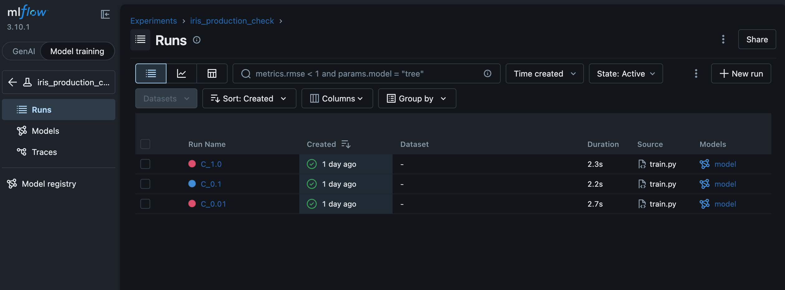

# MLOps-Production-Pipeline-E2E
This repository demonstrates a complete, production-grade Machine Learning lifecycle. Inspired by the 'Made With ML' framework, this project goes beyond model training to implement robust data engineering, automated testing, and CI/CD deployment.

# Quickstart Guide
### Project Status
-local deployment complete and successful
-next steps: containerization 

### Stage 1 Quickstart: Reproduce Locally
1. conda env create -f environment.yml
2. conda activate mlops_prod
3. python src/train.py
4. mlflow ui --port 5000 (to view results)

#TODO update quickstart guide as project progesses 

# End-to-End MLOps Production Pipeline

## 🎯 Project Overview 
This repository demonstrates a complete, production-grade Machine Learning lifecycle. Inspired by the 'Made With ML' framework, this project goes beyond model training to implement robust data engineering, automated testing, and CI/CD deployment.

#TODO add more info here as project develops

**The Goal:** Build a scalable ML system that monitors for data drift and automates retraining.

## 🏗️ Architecture
- **Orchestration:** Ray (Distributed training & serving)
- **Experiment Tracking:** MLflow
- **Data Quality:** Great Expectations
- **API Layer:** FastAPI
- **Containerization:** Docker
- **Monitoring:** Evidently.ai

## 🚀 Live Demo
#TODO update with demo when available 
(link to my Hugging Face Space or Render API endpoint or somehting similiar)

## 🛠️ Performance & Monitoring
#TODO update this template later for P&M
| Metric | Baseline (v1.0) | Current (v1.1) |
| :--- | :--- | :--- |
| Accuracy | 84% | **89%** |
| Inference Latency | 120ms | **95ms** |

> **Note on Model Drift:** #TODO update this later on --> I utilize a daily data stream from [API Name] to monitor for concept drift. View the latest monitoring report [here](#).

## 📖 Roadmap
- [x] Week 1: Baseline Pipeline & Data Validation
- [ ] Week 2: Testing & Containerization
- [ ] Week 3: CI/CD & Cloud Deployment
- [ ] Week 4: Drift Detection & Performance Tuning

## 📖 TODO

- Bridge Conda and Pip - Developed using Conda for environment stability; compatible with Pip for lightweight container deployment. - before deploying to containers export to pip
-add Ray

## 🖼️ Sample Screenshots

### Local Run Experiment Results

